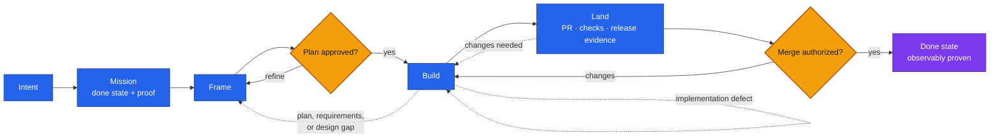
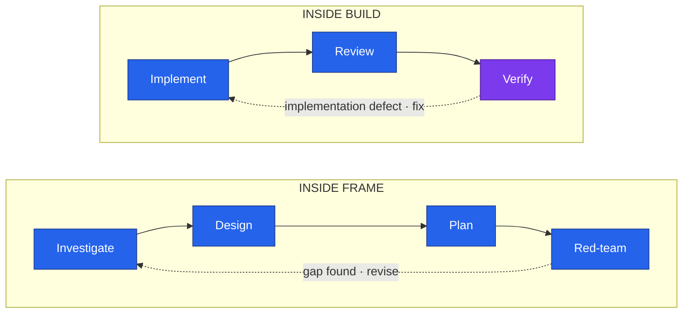

# Nightshift AIDLC

> **Give your agent an outcome—not just a prompt.**

Nightshift AIDLC is an open-source, portable agentic coding harness packaged as a composable skill
kit. It takes a software change from a plain-language request to its requested done state. One
durable `mission` moves through `frame → build → land`, gathering proof as it goes; only the
`aidlc` orchestrator routes between those major phases.

## Why “Nightshift”?

Because development should be able to keep moving safely after you step away. Nightshift frames
the work, waits for plan approval, builds in isolation, verifies the running product, drives one
reviewable change, and reports honestly when evidence sends it backward.

The name means continuity—not unchecked autonomy. Human approval remains part of the lifecycle at
the plan and merge gates, and required host capabilities can never be silently bypassed.

## Why use Nightshift AIDLC?

AI coding agents are fast at producing plausible code. Shipping safely still requires clear
requirements, disciplined review, executable proof, and accountable decisions. Nightshift puts a
reusable engineering harness and concrete guardrails around the agent:

- observable completion criteria before implementation begins;
- human approval before code is written and before a merge is authorized;
- isolated workspaces and one reviewable change per mission;
- fresh-context review plus verification against the running product;
- evidence-driven rewinds when the code, plan, design, or requirements are wrong;
- explicit host capabilities, so missing safety-critical steps fail honestly instead of vanishing.

Use it when you want more autonomy without lowering the bar for evidence or human control.

## How it works



Frame and Build each run an inner loop:



Red-team findings revise the Frame. Implementation defects found by review or verification return
to implementation inside Build. When Build or verification proves the requirements, design, or
plan is wrong, the outer loop returns the mission to Frame. Each phase reports one explicit
outcome: `advance`, `rewind`, `needs_human`, or `stuck`; the mission stays unchanged until its
observable completion criteria are met.

## Portable by design

Nightshift AIDLC keeps lifecycle skills independent from host integrations. Skills define the
methodology and contracts; hosts supply model access, tools, workspaces, verification,
reviewed-change operations, release evidence, and optional memory capabilities. Either side can
evolve without forcing a rewrite of the other.

## What is included

- fourteen focused lifecycle skills and six thin command wrappers;
- versioned v1 schemas for `mission`, `outcome`, and optional `workstreams`;
- provider-neutral host-capability contracts for workspace, verification, reviewed changes,
  release evidence, prior-memory reads, and lesson proposals;
- manifests for Claude Code and Codex plugin marketplaces;
- compatibility, provenance, contribution, and security policies.

## Install from a source checkout

Clone this repository, then use the host-specific plugin directory:

```bash
claude --plugin-dir ./plugins/nightshift
```

For Codex, register the checkout as a local marketplace and install the plugin:

```bash
codex plugin marketplace add .
codex plugin add nightshift@nightshift-aidlc
```

After the public repository exists, both hosts can add `thrrive/nightshift-aidlc` as a Git
marketplace instead of a local path.

See `INSTALL.md` for published installation, upgrade, pinning, and uninstall commands.

## Run the lifecycle

Use the namespaced entrypoint in a skills-compatible host:

```text
/nightshift:aidlc Add a CSV export to the holdings page
```

The default done state is stable production. Use `--frame-only` for an approved plan or `--pr-only`
for a verified reviewed change. The lifecycle always retains its plan and merge authorization
gates; unavailable required capabilities fail honestly instead of being silently bypassed.

Read `docs/lifecycle.md`, `docs/handoff-contract.md`, and `docs/host-capabilities.md` for the full
behavior and extension seams.

## Resources

- [From Prompts to Harnesses](https://mihirsambhus.substack.com/p/from-prompts-to-harnesses) — the
  story and operating model behind Nightshift: why agentic coding needs context, guardrails,
  evidence, model diversity, mission control, and human judgment around the agents.
- [Coding Is Not the Job Anymore. Engineering Still Is.](https://mihirsambhus.substack.com/p/coding-is-not-the-job-anymore-engineering)
  — the precursor on why verification, coherence, taste, and accountability become more important
  as code gets cheaper to produce.
- [`docs/lifecycle.md`](docs/lifecycle.md) — the phase machine and its rewind paths.
- [`docs/handoff-contract.md`](docs/handoff-contract.md) — the durable mission and outcome contract.
- [`docs/host-capabilities.md`](docs/host-capabilities.md) — the portable boundary between skills
  and agent hosts.

## Status

`0.1.0` is the first public preview, built from a lifecycle that has already driven more than 100
real missions. The published artifact has also passed cross-host portability checks: a frame-only
mission in Claude Code and a browser-verified PR-ready mission in Codex.

## License

MIT.
