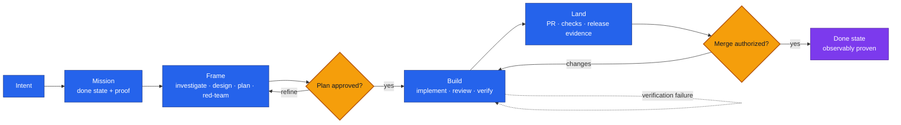

# Nightshift AIDLC

> **Give your agent an outcome—not just a prompt.**

Nightshift AIDLC is the open-source, portable agent skill kit for taking a software change from a
plain-language request to its requested done state. One durable `mission` moves through
`frame → build → land`, gathering proof as it goes; only the `aidlc` orchestrator routes between
those major phases.

## Why “Nightshift”?

Because development should be able to keep moving safely after you step away. Nightshift frames
the work, waits for plan approval, builds in isolation, verifies the running product, drives one
reviewable change, and reports honestly when evidence sends it backward.

The name means continuity—not unchecked autonomy. Human approval remains part of the lifecycle at
the plan and merge gates, and required host capabilities can never be silently bypassed.

## How it works



Each phase returns one explicit outcome: `advance`, `rewind`, `needs_human`, or `stuck`. Rewinds
are part of the design, not exceptions to hide. The mission remains unchanged while the
orchestrator routes the work until its observable completion criteria are actually met.

## What this package is—and is not

This package contains the methodology and contracts only. It does not contain or require the
private Nightshift execution plane, control plane, target registry, model router, hosted workers,
SecondBrain, or an agent-kernel implementation.

That boundary is intentional: skills describe the lifecycle; hosts supply model access, tools,
workspaces, verification, reviewed-change operations, release evidence, and optional memory
capabilities. You can improve or replace either side without rewriting the other.

## What is included

- fourteen focused lifecycle skills and six thin command wrappers;
- versioned v1 schemas for `mission`, `outcome`, and optional `workstreams`;
- provider-neutral host-capability contracts for workspace, verification, reviewed changes,
  release evidence, prior-memory reads, and lesson proposals;
- manifests for Claude Code and Codex plugin marketplaces;
- compatibility, provenance, contribution, and security policies.

## Install from a source checkout

Clone this repository, then use the host-specific plugin directory:

```bash
claude --plugin-dir ./plugins/nightshift
```

For Codex, register the checkout as a local marketplace and install the plugin:

```bash
codex plugin marketplace add .
codex plugin add nightshift@nightshift-aidlc
```

After the public repository exists, both hosts can add `thrrive/nightshift-aidlc` as a Git
marketplace instead of a local path.

See `INSTALL.md` for published installation, upgrade, pinning, and uninstall commands.

## Run the lifecycle

Use the namespaced entrypoint in a skills-compatible host:

```text
/nightshift:aidlc Add a CSV export to the holdings page
```

The default done state is stable production. Use `--frame-only` for an approved plan or `--pr-only`
for a verified reviewed change. The lifecycle always retains its plan and merge authorization
gates; unavailable required capabilities fail honestly instead of being silently bypassed.

Read `docs/lifecycle.md`, `docs/handoff-contract.md`, and `docs/host-capabilities.md` for the full
behavior and extension seams.

## Status

`0.1.0` is the first public preview. The package has completed one frame-only mission in Claude Code
and one browser-verified PR-ready mission in Codex from generated artifacts.

## License

MIT.
