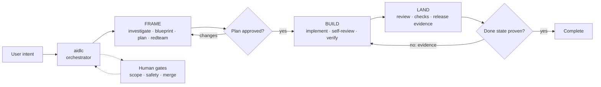

# Nightshift AIDLC

> **Give your agent an outcome—not just a prompt.**

## Executive summary

Nightshift AIDLC is the open-source, portable workflow and skill layer for agentic software delivery.
It carries one durable mission through requirements, implementation, verification, review, and
release gates. The package defines lifecycle rules, workflow state, evidence contracts, and the
host boundary; Claude, Codex, or another compatible host supplies model access and execution.

The architecture is deliberately split:

- **Nightshift AIDLC** — portable skills, workflows, schemas, and host mappings.
- **Host runtime** — adapters, tools, workspaces, mission storage, and deterministic execution.
- **Human authority** — plan approval, scope and safety decisions, merge authorization, and
  unresolved or exhausted review loops remain explicit gates.

Use `v1.0.0-rc.7` to test the workflow dispatcher through a real Claude or Codex installation. This
candidate adds the named workflow entrypoint while keeping the
stable mission and handoff fields compatible.

Nightshift AIDLC is an open-source, portable agentic coding harness packaged as a composable skill
kit. It takes a software change from a plain-language request to its requested done state. One
durable `mission` moves through `frame → build → land`, gathering proof as it goes; only the
`aidlc` orchestrator routes between those major phases.

## Why “Nightshift”?

Because development should be able to keep moving safely after you step away. Nightshift frames
the work, waits for plan approval, builds in isolation, verifies the running product, drives one
reviewable change, and reports honestly when evidence sends it backward.

The name means continuity—not unchecked autonomy. In gated mode, routine plan and subtask approvals
pause the lifecycle. In YOLO mode, routine transitions and bounded recovery loops continue
automatically; meaningful scope, safety, policy, unresolved-review, blocker, and authorization
decisions still surface to a human.

## Why use Nightshift AIDLC?

AI coding agents are fast at producing plausible code. Shipping safely still requires clear
requirements, disciplined review, executable proof, and accountable decisions. Nightshift puts a
reusable engineering harness and concrete guardrails around the agent:

- observable completion criteria before implementation begins;
- human approval before code is written and before a merge is authorized;
- one durable, human-readable mission document with investigation, plan, attempts, evidence, model
  provenance, cost availability, and gates;
- isolated workspaces and one reviewable change per mission;
- fresh-context review plus verification against the running product;
- evidence-driven rewinds when the code, plan, design, or requirements are wrong;
- explicit host capabilities, so missing safety-critical steps fail honestly instead of vanishing.

Use it when you want more autonomy without lowering the bar for evidence or human control.

## Architecture in one view



The public package is the workflow layer: skills perform phase work, workflow definitions own
ordering and bounded loops, and schemas keep handoffs/evidence machine-readable. A host adapter is
the execution layer: it binds model calls, tools, workspaces, mission storage, and verification to
those contracts. Red-team findings revise Frame; product failures stay inside Build; landing signals
with evidence return to Build. Every phase reports `advance`, `rewind`, `needs_human`, or `stuck`,
while the mission itself remains unchanged.

Independent, path-disjoint workstreams may fan out to isolated Codex or Claude subagents, join at a
barrier, merge in declared order, and undergo review and verification on the merged result. Review
recovery is bounded by default to 2 attempts per finding, 3 per subtask, and 8 per mission. See the
[execution workflow](https://github.com/thrrive/nightshift-aidlc/blob/main/plugins/nightshift/skills/aidlc/references/execution-workflow.md) for routing,
resume state, and escalation rules.

## Skill and workflow entrypoints

Users normally start a named workflow, not an internal phase skill:

```text
/nightshift:workflow nightshift-aidlc Add a CSV export to the holdings page
```

The workflow dispatcher loads `workflows/manifest.json`, applies the portable workflow definition,
and delegates phase work to the existing `aidlc` skill. The direct skill entrypoint remains
supported for hosts that do not expose the dispatcher:

```text
/nightshift:aidlc Add a CSV export to the holdings page
```

Inspect durable missions with:

```text
/nightshift:missions
```

After a plan is approved, explicitly start one dependency-ready child with:

```text
/nightshift:workflow nightshift-missions-next <mission-id>
```

The equivalent direct skill command is `/nightshift:missions <mission-id> --next`. In `mode: yolo`,
routine eligible transitions may happen automatically. Parallel workstreams are selected and
joined by the host workflow runner; users should not launch duplicate `--next` commands.

The workflow names and fallback commands are portable across hosts:

| Workflow | Purpose | Skill fallback |
| --- | --- | --- |
| `nightshift-aidlc` | Full mission lifecycle | `/nightshift:aidlc <request>` |
| `nightshift-missions-next` | Start one eligible child | `/nightshift:missions <mission-id> --next` |

## Skill hierarchy

The kit contains sixteen focused skills. `aidlc` is the parent skill and the only lifecycle router;
the indented skills are the phases and specialists it composes. The directories remain separately
loadable for hosts that already have the required handoff, but invoking a child does not transfer
ownership of mission transitions away from `aidlc`.

```text
`aidlc`                       parent orchestrator: mission, routing, and human gates
├── `intake`                  plain-language request → mission
├── `frame`                   requirements → approved plan
│   ├── `investigate`         repository facts, requirements, and open questions
│   ├── `blueprint`           components, contracts, rollout, and verification shape
│   ├── `plan`                ordered implementation plan and definition of done
│   └── `redteam`             adversarial review of the pinned blueprint and plan
├── `build`                   approved plan → verified reviewable change
│   ├── `implement`           scoped implementation against repository conventions
│   ├── `self-review`         fresh-context diff review and oracle audit
│   └── `verify`              browser, API, CLI, library, or custom proof
└── `land`                    reviewed change → requested done state
    ├── `pr-drive`            checks and review feedback → fixes or route-backs
    └── `release-gate`        review, verification, and release evidence
`missions`                    inspect missions and start the next eligible subtask
`workflow`                    start a named workflow and delegate to its entry skill
```

`aidlc` carries one unchanged `mission` through this hierarchy. Host runtimes may add a mission
registry, project discovery, control plane, memory, or other visibility layer around the skill kit;
those integrations observe and provide capabilities without redefining the lifecycle contract.

When hierarchical execution is available, intake/frame also produce an ordered subtask plan and a
per-step model plan. The default workflow starts the first eligible child, then pauses after each
child with a summary gate; a host may expose `mode: yolo` to auto-advance routine transitions while
preserving meaningful-human escalation. Published mission evidence shows estimated model/token/cost
data separately from host-observed usage and cost.

Read the **[complete lifecycle and skill reference](docs/lifecycle.md)** for composition rules,
rewind paths, flags, handoffs, workspace isolation, and human gates. The canonical executable
contracts live in each packaged `skills/<name>/SKILL.md`.

Mission work is not trapped in chat history. A v2-capable host gives each fresh invocation an
immutable mission ID and one obvious human document:

```text
nightshift/missions/<mission-slug>--<mission-id>/
  MISSION.md
  .aidlc/
    bundle.json
    mission.json
    events.jsonl
    latest-outcome.json
    reviews/
```

[`MISSION.md`](docs/MISSION.template.md) tells the complete human story: requirements, plan,
allowed loops, every observed attempt and rewind, model and token provenance, known cost and its
source, unavailable attribution, separate tool activity, review, verification, and current gates.
Validated routing and append-only evidence stay under `.aidlc/`; the host never parses prose to
decide what happens next.

Fresh invocation and resume are deliberately different. **Running multiple missions in one
worktree does not overwrite earlier mission documents.** A fresh run always creates a new
`<mission-id>` directory, even for an identical ask. A rewind or later resume appends to one existing
bundle only when the caller supplies its exact mission ID or bundle reference.

Read the **[human-first mission-bundle contract](docs/mission-bundles.md)** for identity, event,
telemetry, redaction, projection, and compatibility semantics. The
**[durable frame-artifact contract](docs/frame-artifacts.md)** retains the six-file v1 format for
older hosts. Format support is negotiated explicitly; the stable v1 mission and outcome routing
fields do not change.

Storage precedence remains: the target's declared feature-docs path, a user-selected durable
destination, then the invocation-directory fallback. Temporary directories and agent scratch space
may be used internally, but cannot be the only durable copy. If durable writing is unavailable,
Frame returns `needs_human` with inline recovery content and asks for a destination or explicit
inline-only waiver.

This protects new runs. It cannot recover artifacts that expired with an earlier agent session.

## Portable by design

Nightshift AIDLC keeps lifecycle skills independent from host integrations. Skills define the
methodology and contracts; hosts supply model access, tools, workspaces, verification,
reviewed-change operations, release evidence, and optional memory capabilities. Either side can
evolve without forcing a rewrite of the other.

## What is included

- sixteen focused lifecycle skills and eight thin command wrappers;
- versioned v1 schemas for `mission`, `outcome`, evidence-backed `review`, and optional
  `workstreams`, plus additive human-first bundle and event evidence;
- provider-neutral host-capability contracts for durable frame artifacts, workspace, verification,
  reviewed changes, review attestation, release evidence, prior-memory reads, and lesson proposals;
- manifests for Claude Code and Codex plugin marketplaces;
- compatibility, provenance, contribution, and security policies.

## Install from a source checkout

Clone this repository, then use the host-specific plugin directory:

```bash
claude --plugin-dir ./plugins/nightshift
```

For Codex, register the checkout as a local marketplace and install the plugin:

```bash
codex plugin marketplace add .
codex plugin add nightshift@nightshift-aidlc
```

After the public repository exists, both hosts can add `thrrive/nightshift-aidlc` as a Git
marketplace instead of a local path.

See `INSTALL.md` for published installation, upgrade, pinning, and uninstall commands.

## Run the lifecycle

Use the named workflow entrypoint in a compatible host:

```text
/nightshift:workflow nightshift-aidlc Add a CSV export to the holdings page
```

The default done state is stable production. The workflow delegates to `aidlc`; use
`/nightshift:aidlc` directly when the host has no workflow dispatcher. Use `--frame-only` for an approved plan or `--pr-only`
for a verified reviewed change. The lifecycle always retains its plan and merge authorization
gates; unavailable required capabilities fail honestly instead of being silently bypassed.

Read `docs/lifecycle.md`, `docs/handoff-contract.md`, `docs/review-contract.md`, and
`docs/host-capabilities.md` for the full behavior and extension seams.

## Inspect missions

Use the `missions` skill or workflow to inspect durable mission records, parent/subtask relationships, current
status, next actions, and available artifacts:

```text
$nightshift:missions
```

In hosts that use slash commands, invoke the same skill as `/nightshift:missions`. The skill is
read-only by default; it reports the host capability or durable mission store available in the
current environment.

For a visual, read-only mission browser, run the [local mission control](control-plane/README.md)
and open <http://127.0.0.1:8091/missions>. It groups subtasks beneath their parent missions and
renders the available durable documents without starting work.

## Workflows

The portable workflow bundle is under `plugins/nightshift/workflows`. Its manifest defines stable
names, entry skills, and host-independent fallbacks. Start the full lifecycle with
`nightshift-aidlc`; start one child with `nightshift-missions-next`. Hosts with a native workflow
facility register those definitions. Other hosts use `/nightshift:workflow`, which loads the same
definitions and delegates to the same skills. This keeps workflow behavior and skill behavior
identical instead of maintaining two separate implementations.

## Reinstall and invoke the release candidate

Install the pinned `v1.0.0-rc.7` candidate for the workflow command.

Claude, from a pinned source checkout:

```bash
git clone --branch v1.0.0-rc.7 https://github.com/thrrive/nightshift-aidlc.git nightshift-aidlc-rc7
claude --plugin-dir ./nightshift-aidlc-rc7/plugins/nightshift \
  --add-dir ./nightshift-aidlc-rc7/plugins/nightshift
```

Codex, from the published marketplace:

```bash
codex plugin marketplace add thrrive/nightshift-aidlc --ref v1.0.0-rc.7
codex plugin remove nightshift@nightshift-aidlc 2>/dev/null || true
codex plugin add nightshift@nightshift-aidlc
```

Restart the host, then start the full workflow:

```text
/nightshift:workflow nightshift-aidlc <change request>
```

Inspect missions and advance one child at a time:

```text
/nightshift:missions
/nightshift:workflow nightshift-missions-next <mission-id>
```

The direct skill equivalents remain `/nightshift:aidlc <change request>` and
`/nightshift:missions <mission-id> --next`. In YOLO mode, routine eligible child transitions may
advance automatically; do not issue duplicate next-subtask commands while a child is running.

## Resources

- [From Prompts to Harnesses](https://mihirsambhus.substack.com/p/from-prompts-to-harnesses) — the
  story and operating model behind Nightshift: why agentic coding needs context, guardrails,
  evidence, model diversity, mission control, and human judgment around the agents.
- [Coding Is Not the Job Anymore. Engineering Still Is.](https://mihirsambhus.substack.com/p/coding-is-not-the-job-anymore-engineering)
  — the precursor on why verification, coherence, taste, and accountability become more important
  as code gets cheaper to produce.
- [`docs/lifecycle.md`](docs/lifecycle.md) — the complete skill reference, phase machine, and
  rewind paths.
- [`docs/handoff-contract.md`](docs/handoff-contract.md) — the durable mission and outcome contract.
- [`docs/mission-bundles.md`](docs/mission-bundles.md) — collision-safe mission identity, the
  `MISSION.md` projection, attempt history, and model/tool/cost evidence.
- [`docs/review-contract.md`](docs/review-contract.md) — evidence strength, adversarial lenses,
  findings, remediation, and fail-closed review decisions.
- [`docs/host-capabilities.md`](docs/host-capabilities.md) — the portable boundary between skills
  and agent hosts.

## Status

`1.0.0-rc.7` is the current stable-v1 candidate. It preserves the canonical v1 mission and
outcome contract while adding portable workflow definitions, Claude/Codex host mappings, the
explicit next-subtask capability contract, and the human-first v2 evidence bundle. Stable
promotion requires two fresh external missions from this exact tag, including a rewind and a
human gate.

## License

MIT.
