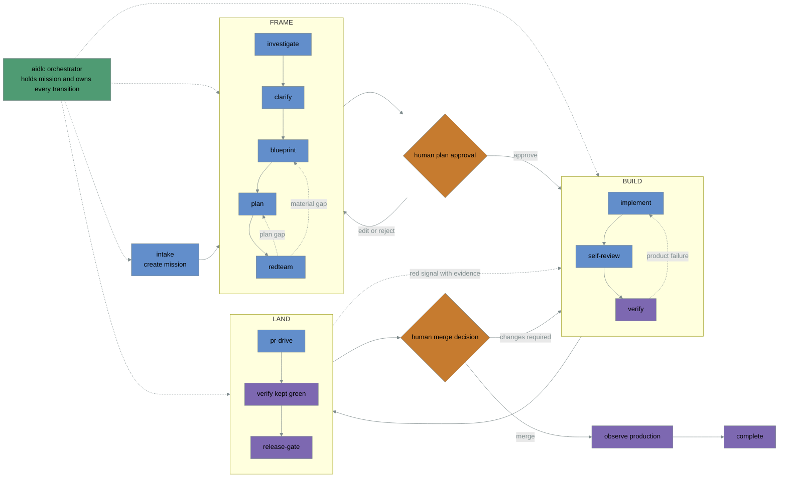

# Nightshift AIDLC

> **Give your agent an outcome—not just a prompt.**

Nightshift AIDLC is an open-source, portable agentic coding harness packaged as a composable skill
kit. It takes a software change from a plain-language request to its requested done state. One
durable `mission` moves through `frame → build → land`, gathering proof as it goes; only the
`aidlc` orchestrator routes between those major phases.

## Why “Nightshift”?

Because development should be able to keep moving safely after you step away. Nightshift frames
the work, waits for plan approval, builds in isolation, verifies the running product, drives one
reviewable change, and reports honestly when evidence sends it backward.

The name means continuity—not unchecked autonomy. Human approval remains part of the lifecycle at
the plan and merge gates, and required host capabilities can never be silently bypassed.

## Why use Nightshift AIDLC?

AI coding agents are fast at producing plausible code. Shipping safely still requires clear
requirements, disciplined review, executable proof, and accountable decisions. Nightshift puts a
reusable engineering harness and concrete guardrails around the agent:

- observable completion criteria before implementation begins;
- human approval before code is written and before a merge is authorized;
- durable, user-visible investigation and plan artifacts before approval;
- isolated workspaces and one reviewable change per mission;
- fresh-context review plus verification against the running product;
- evidence-driven rewinds when the code, plan, design, or requirements are wrong;
- explicit host capabilities, so missing safety-critical steps fail honestly instead of vanishing.

Use it when you want more autonomy without lowering the bar for evidence or human control.

## How it works



This is the same phase machine documented in [`docs/lifecycle.md`](docs/lifecycle.md). Red-team
findings revise the Frame; product failures stay inside Build; requirements, design, or plan gaps
return to Frame; and red landing signals or requested changes return to Build. Each phase reports
one explicit outcome: `advance`, `rewind`, `needs_human`, or `stuck`; the mission stays unchanged
until its observable completion criteria are met.

## Skill map

The kit contains fourteen focused skills. Six are user-facing entrypoints (`aidlc`, `intake`,
`frame`, `build`, `verify`, and `land`); the others are composable specialists called by their
owning phase. You can run a major phase independently when you already have the required handoff,
but only `aidlc` routes between major phases.

| Skill | Role |
|---|---|
| `aidlc` | Owns the mission, routes every major-phase transition, and pauses at human gates. |
| `intake` | Turns a plain-language request into observable completion criteria and lifecycle limits. |
| `frame` | Runs the complete pre-code loop and returns a plan for human approval. |
| `investigate` | Reads the repository and gathers requirements, constraints, conventions, and open questions. |
| `blueprint` | Designs the component and contract changes, rollout, observability, and verification shape. |
| `plan` | Produces the ordered implementation plan and definition of done the human will approve. |
| `redteam` | Runs five adversarial lenses over the pinned blueprint and plan, with evidence-bound findings and remediation rounds. |
| `build` | Owns the approved plan through an isolated, verified, reviewable change. |
| `implement` | Writes the scoped change against the approved plan and repository conventions. |
| `self-review` | Reviews the pinned diff in fresh context, audits test oracles and proof strength, and re-reviews remediation. |
| `verify` | Proves the exact revision through its approved browser, API, CLI, library, or custom checks. |
| `land` | Owns the reviewed change through checks, feedback, merge authorization, and the requested done state. |
| `pr-drive` | Triages checks and review feedback into fixes, responses, rewinds, or human decisions. |
| `release-gate` | Combines review, verification, and release evidence, then observes the authorized result. |

Read the **[complete lifecycle and skill reference](docs/lifecycle.md)** for composition rules,
rewind paths, flags, handoffs, workspace isolation, and human gates. The canonical executable
contracts live in each packaged `skills/<name>/SKILL.md`.

Frame work is not trapped in chat history. The
**[durable frame-artifact contract](docs/frame-artifacts.md)** requires the mission,
investigation, blueprint, plan, red-team review, and handoff to be persisted before approval. When
a project has no documentation convention, an interactive run uses this visible bundle under the
directory where the user started the agent:

```text
nightshift/<mission-slug>/
  mission.json
  investigation.md
  blueprint.md
  plan.md
  redteam-review.json
  handoff.yaml
```

Storage precedence is: the target's declared feature-docs path, a user-selected durable
destination, then the invocation-directory fallback above. Temporary directories and agent scratch
space may be used internally, but cannot be the only copies or the paths reported in the approval
handoff. If durable writing is unavailable, Frame returns `needs_human` with inline recovery content
and asks for a destination or explicit inline-only waiver.

This protects new runs. It cannot recover artifacts that expired with an earlier agent session.

## Portable by design

Nightshift AIDLC keeps lifecycle skills independent from host integrations. Skills define the
methodology and contracts; hosts supply model access, tools, workspaces, verification,
reviewed-change operations, release evidence, and optional memory capabilities. Either side can
evolve without forcing a rewrite of the other.

## What is included

- fourteen focused lifecycle skills and six thin command wrappers;
- versioned v1 schemas for `mission`, `outcome`, evidence-backed `review`, and optional
  `workstreams`;
- provider-neutral host-capability contracts for durable frame artifacts, workspace, verification,
  reviewed changes, review attestation, release evidence, prior-memory reads, and lesson proposals;
- manifests for Claude Code and Codex plugin marketplaces;
- compatibility, provenance, contribution, and security policies.

## Install from a source checkout

Clone this repository, then use the host-specific plugin directory:

```bash
claude --plugin-dir ./plugins/nightshift
```

For Codex, register the checkout as a local marketplace and install the plugin:

```bash
codex plugin marketplace add .
codex plugin add nightshift@nightshift-aidlc
```

After the public repository exists, both hosts can add `thrrive/nightshift-aidlc` as a Git
marketplace instead of a local path.

See `INSTALL.md` for published installation, upgrade, pinning, and uninstall commands.

## Run the lifecycle

Use the namespaced entrypoint in a skills-compatible host:

```text
/nightshift:aidlc Add a CSV export to the holdings page
```

The default done state is stable production. Use `--frame-only` for an approved plan or `--pr-only`
for a verified reviewed change. The lifecycle always retains its plan and merge authorization
gates; unavailable required capabilities fail honestly instead of being silently bypassed.

Read `docs/lifecycle.md`, `docs/handoff-contract.md`, `docs/review-contract.md`, and
`docs/host-capabilities.md` for the full behavior and extension seams.

## Resources

- [From Prompts to Harnesses](https://mihirsambhus.substack.com/p/from-prompts-to-harnesses) — the
  story and operating model behind Nightshift: why agentic coding needs context, guardrails,
  evidence, model diversity, mission control, and human judgment around the agents.
- [Coding Is Not the Job Anymore. Engineering Still Is.](https://mihirsambhus.substack.com/p/coding-is-not-the-job-anymore-engineering)
  — the precursor on why verification, coherence, taste, and accountability become more important
  as code gets cheaper to produce.
- [`docs/lifecycle.md`](docs/lifecycle.md) — the complete skill reference, phase machine, and
  rewind paths.
- [`docs/handoff-contract.md`](docs/handoff-contract.md) — the durable mission and outcome contract.
- [`docs/review-contract.md`](docs/review-contract.md) — evidence strength, adversarial lenses,
  findings, remediation, and fail-closed review decisions.
- [`docs/host-capabilities.md`](docs/host-capabilities.md) — the portable boundary between skills
  and agent hosts.

## Status

`1.0.0-rc.1` is the immutable stable-v1 candidate. It preserves the preview's canonical mission
and outcome contract while adding durable frame artifacts, evidence-backed review, and executable
backward-compatibility checks. Stable promotion requires two fresh external missions from this
exact tag, including a rewind and a human gate.

## License

MIT.
