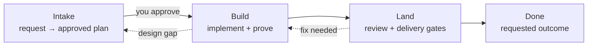

# Nightshift AIDLC

Turn a product request into a reviewed, verified, deploy-ready change—without handing over the
decisions that need a human.

Nightshift is a portable skill kit for Claude Code and Codex. It gives an agent one durable mission
and a simple lifecycle:


```mermaid
flowchart LR
    A["Intake\nrequest → approved plan"] -->|you approve| B["Build\nimplement + prove"]
    B --> C["Land\nreview + delivery gates"]
    C --> D["Done\nrequested outcome"]
    B -. design gap .-> A
    C -. fix needed .-> B
```

The plan is the last thing shown in Intake. You approve, refine, or reject it before any product
code is written.

## Start here

Install the plugin, then describe the change in plain language:

```text
/nightshift:aidlc Add CSV export to the holdings table. Include the active filters and verify it in the browser.
```

Nightshift will:

1. investigate the target and turn your request into an approval-ready plan;
2. stop and show that plan—nothing is implemented yet;
3. after approval, build in an isolated workspace, review its own work, and run the relevant proof;
4. drive the pull request and delivery checks to the outcome you requested.

Use `--frame-only` when you want a plan only, `--pr-only` when a reviewable PR is the finish line,
and `--no-verify` only when the target cannot be exercised in this run.

## Choose your path

| I want to… | Use | What happens |
| --- | --- | --- |
| Deliver a complete change | `/nightshift:aidlc <request>` | Runs Intake, waits for your plan approval, then Build and Land. |
| Get a plan before committing | `/nightshift:intake <request> --frame-only` | Investigates and presents an approval-ready plan. |
| Implement an already-approved plan | `/nightshift:build` | Makes one focused, verified reviewable change. |
| Finish a ready pull request | `/nightshift:land` | Drives checks, feedback, merge and configured delivery gates. |
| See where work stands | `/nightshift:missions` | Reads durable missions and identifies the next eligible action. |

`aidlc` is the lifecycle entrypoint; `intake`, `build`, `land`, and `missions` are the public
phase and status skills. The specialist skills that power them
(`investigate`, `blueprint`, `plan`, `redteam`, `implement`, `self-review`, `verify`,
`pr-drive`, and `release-gate`) are there when you need to customize a host or inspect the
workflow—not steps you need to memorize. `frame` remains a compatibility alias for existing
installations; new work should start with `intake`. `workflow` is an optional host dispatcher.

## How it keeps you in control

| Moment | Nightshift does | You decide |
| --- | --- | --- |
| Before code | Investigates, designs, pressure-tests, and saves the plan. | Approve, refine, or reject the plan. |
| During delivery | Works in an isolated workspace, reviews the diff, and gathers evidence. | Scope changes and meaningful trade-offs. |
| At the finish line | Reads PR checks and configured delivery signals. | Merge and release authority, unless your policy delegates it. |

The mission and its evidence survive the chat in a durable bundle, so a resumed session can pick
up the real state instead of reconstructing it from conversation history. Read the
[complete lifecycle and skill reference](docs/lifecycle.md), the
[evidence-backed review contract](docs/review-contract.md), the
[durable frame-artifact contract](docs/frame-artifacts.md), and the
[human-first mission-bundle contract](docs/mission-bundles.md) when you need the full protocol.

## Install

### Claude Code

```bash
claude plugin marketplace add thrrive/nightshift-aidlc
claude plugin install nightshift@nightshift-aidlc
```

### Codex

```bash
codex plugin marketplace add thrrive/nightshift-aidlc
codex plugin add nightshift@nightshift-aidlc
```

For a local checkout:

```bash
git clone https://github.com/thrrive/nightshift-aidlc.git
cd nightshift-aidlc
codex --plugin-dir plugins/nightshift
```

See [INSTALL.md](INSTALL.md) for host-specific setup and [COMPATIBILITY.md](COMPATIBILITY.md) for
the capability contract.

## Optional Mission Control

Mission Control is a local, read-only browser for durable mission state. It is never started
silently: when a host can launch it, Nightshift should ask whether you want it for this run. Most
terminal workflows do not need it; use it when a visual status view would help.

```bash
python3 control-plane/server.py --port 8091 --mission-root "$PWD"
```

Then open `http://127.0.0.1:8091/missions`. The dashboard reads local mission bundles; it does not execute
code or grant merge authority.


## What this package is—and is not

This repository contains the portable lifecycle skills, durable contracts, and optional local
mission browser. It works against many repositories and does not require a hosted control plane.
The full execution runtime—job orchestration, sandbox provisioning, target registry, and provider
integrations—belongs in a separately operated environment.

For the design thinking behind moving from one-off prompts to durable harnesses, see
[From Prompts to Harnesses](https://mihirsambhus.substack.com/p/from-prompts-to-harnesses).

## Contributing

Run the package checks before proposing a change:

```bash
python3 scripts/check_package.py
python3 scripts/check_schemas.py
python3 scripts/check_mission_bundles.py
```

See [CONTRIBUTING.md](CONTRIBUTING.md), [SECURITY.md](SECURITY.md), and the [MIT License](LICENSE).
