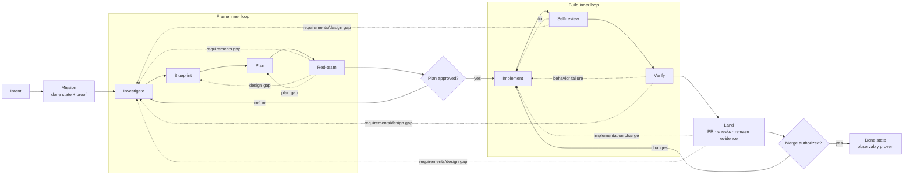

# {{ mission.title }}

Mission ID: `{{ bundle.mission_id }}`  
Status: `{{ status }}`  
Done state: `{{ mission.done_state }}`  
Updated: `{{ updated_at }}`

## Ask

{{ mission.ask_verbatim }}

## Observable done-when conditions

{{ mission.done_when_checklist }}

## Current decision and plan

{{ current_decision }}

{{ approved_plan }}

## Lifecycle and allowed loops

## Observed route and attempts

| Sequence | Phase | Step | Phase attempt | Step attempt | Result | Route or evidence |
|---:|---|---|---:|---:|---|---|
{{ observed_attempt_rows }}

## Model calls

Execution mode: `{{ execution_mode }}`

## Planned model usage

| Subtask | Step | Model hint | Est. input tokens | Est. output tokens | Est. cost USD |
|---|---|---|---:|---:|---:|
{{ model_plan_rows }}

Estimates are planning data; the model-call ledger below contains only host-observed usage and cost.

| Phase | Step | Attempt | Requested model | Resolved model | Usage | Cost and source | Duration | Availability |
|---|---|---:|---|---|---|---|---|---|
{{ llm_call_rows }}

Known cost subtotal: `{{ known_cost_subtotal_usd }}`  
LLM calls with unavailable cost: `{{ unavailable_cost_call_count }}`  
Total status: `{{ cost_completeness }}`

## Tool activity

| Phase | Step | Attempt | Tool | Operation | Status | Duration | Safe evidence |
|---|---|---:|---|---|---|---|---|
{{ tool_call_rows }}

Raw tool arguments and results are intentionally excluded.

## Reviews and findings

{{ review_summary }}

## Verification and delivery evidence

{{ verification_and_delivery }}

## Current gate, blockers, and next route

{{ current_gate_blockers_and_route }}

## Machine record

Validated state and append-only evidence live under `.aidlc/`. This document is generated for human
review and may be rebuilt; it is not parsed for routing.
