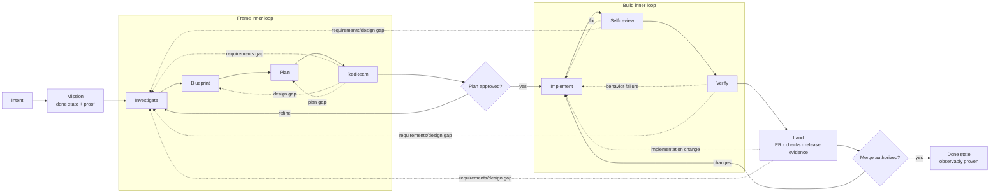

# The lifecycle

The harness is a small phase machine. The `aidlc` orchestrator holds the `mission` and calls
exactly one major phase at a time, reading each phase's handoff to decide the next move. Three
major phases, each composing focused subskills:

The portable payload is defined by the [handoff contract](handoff-contract.md). Red-team,
self-review, and reviewed-change evidence follows the [review contract](review-contract.md).
Effects supplied by an agent host follow the [host capability contract](host-capabilities.md);
unavailable optional capabilities degrade explicitly without changing the mission.

When the host supports `aidlc-mission-bundle/v2`, one generated
[`MISSION.md`](mission-bundles.md) follows the mission through every phase. Its hidden event ledger
retains step attempts, rewinds, model and tool provenance, known/unknown cost, verification, and
gates. This evidence does not change the v1 routing payload.

Before investigation begins, `frame` resolves one [durable artifact
bundle](frame-artifacts.md). Every subskill writes its complete result there, and the bundle's
mission, investigation, blueprint, plan, review, and handoff paths remain visible through the human
approval gate. Agent scratch storage and conversation history are never the only copies.

## Skill entrypoints and references

Each `skills/<name>/SKILL.md` is the concise behavioral entrypoint: it states when to use the skill,
the decisions it owns, and the handoff it returns. Detailed templates, record shapes, and routing
tables live one level below that skill in `references/`. An entrypoint links every required
reference explicitly and tells the agent when to read it; references never form a deeper tree.

This split keeps the phase machine scannable without duplicating or weakening its contracts. It
does not change transition ownership: subskills return their outcome, major phases compose only
their own subskills, and `aidlc` remains the sole router between major phases.

## Phases

### intake — prompt → mission
Runs once, before the orchestrator loop. Reads the freeform request and the target's config,
and emits a `mission` (`ask`, `done_state`, `done_when`, `halts`). If the request is too vague
to form `done_when`, it returns `needs_human` with a couple of sharp clarifying questions
rather than guessing.

### frame — requirements to an approved plan
Owns everything before code is written. Composes:
- **investigate** — requirements, current state, prior art, repo conventions, open questions.
- **clarify gate** — before designing, `frame` resolves the genuine ambiguities investigate
  surfaced. In an interactive/command-line session it probes the user with a few sharp,
  code-grounded questions and waits; headless, it proceeds under stated assumptions and flags
  them. Skipped only when scope and acceptance are already unambiguous.
- **blueprint** — the technical approach: components touched, data/contract changes, rollout
  and observability expectations, and what "proven" means for this change (the verification
  shape).
- **plan** — a human-approvable implementation plan and a definition of done.
- **redteam** — an evidence-backed adversarial pass over the pinned plan/blueprint. It runs five
  independent lenses, retains stable findings through remediation, rewinds material gaps, and
  holds incomplete evidence for human judgment.

`frame` ends by returning `advance` — but the orchestrator **halts for human plan approval**
before entering `build`. With `--frame-only` (or `done_state: frame-approved`), the loop stops
here. Before opening that gate, it persists the complete frame bundle and reports the exact durable
paths. Without an authorized durable destination it returns `needs_human` with inline recovery
content rather than implying that temporary files will survive.

### build — approved plan to a verified change
Owns implementation. Composes:
- **implement** — write the change against the approved plan; focused commits; no scope creep.
- **self-review** — a fresh-context, evidence-backed review of the pinned diff against the plan and
  definition of done. It checks test-oracle sensitivity, binds behavioral claims to host-observed
  evidence, re-reviews fixes, and rewinds plan/design gaps instead of expanding scope.
- **verify** — run the approved browser, API, CLI, library, or custom shape against the exact
  revision. A product failure rewinds to `build`; unavailable execution is `unproven` and blocks.

`build` uses workspace and pull-request capabilities to prepare an isolated change and open one
review request. With `--pr-only` (or `done_state: pr-ready`), the loop stops once it is open and
verified.

### land — reviewed change to requested done state
Owns everything after the reviewed change exists. Composes:
- **pr-drive** — monitor checks and review feedback; triage each item to fix / respond / rewind.
- **verify** — kept green as commits land (re-run on change).
- **release-gate** — combine required change checks, review, verification, and configured release
  evidence. Signals are gathered deterministically through host capabilities so the gate is
  auditable and provider-neutral.

An optional **review council** (a CI action running several models over the diff) posts one
structured review per push that `pr-drive` triages; it raises `REQUEST_CHANGES` on a blocker but
never auto-approves, so a real reviewer still owns signal #2.

All three review stages share proof states and decision semantics. Model agreement alone does not
mint proof: `PROVEN` requires host-observed, behavior-sensitive evidence against the pinned subject.
Missing, malformed, partial, or all-error review output produces a `CONDITIONAL` hold. When bounded
review rounds are exhausted, the harness preserves the work and asks for human judgment rather than
silently advancing or discarding the change.

`land` returns `needs_human` for the **merge decision** by default. After an authorized merge, a
no-release target may complete at `merged`; otherwise `release-gate` observes the requested
environment and health evidence until `done_when` is satisfied.

**A red deploy-ready signal rewinds to `build`, it does not dead-end.** When a signal goes red
(failing checks, failed verification, actionable review findings, or a code-fixable release
preview), `land` returns the evidence to `build`. Provider outages, unavailable capabilities, and
policy decisions do not consume code-rewind attempts; they become concrete blockers or human gates.
Every rewind carries the actual evidence into the re-run.

## Workspace isolation

At `build`, request an isolated workspace for the resolved base revision. The host may implement a
worktree, clone, sandbox, or another isolation mechanism. Reuse its opaque reference across
`land → build` route-backs. In-place editing is valid only when target policy selects it explicitly;
never use it as a silent fallback.

## Host entrypoints

Interactive sessions, queues, issue boards, schedulers, and hosted workers may all start the same
phase machine. Those entrypoints map their request into the canonical mission and capabilities; they
do not redefine completion, recovery budgets, or workstream join semantics. A host may expose
`--yolo` or an equivalent request field for autonomous routine transitions.

## Flags

| Flag | Effect |
|---|---|
| `--frame-only` | Produce the approved plan and stop (`done_state: frame-approved`). |
| `--pr-only` | Stop once the verified PR is open (`done_state: pr-ready`). |
| `--skip-frame` | Skip `frame`; only when an approved plan is already in context. |
| `--no-verify` | Waive the approved verification shape — only when explicitly requested. |
| `--yolo` | Auto-advance routine transitions and bounded in-scope recovery; surface meaningful human decisions. |

Default with no flags is the full loop to **stable production**.

## Human gates

- **Routine gates** — plan approval and between-child proceed prompts in gated mode; YOLO advances
  these automatically.
- **Meaningful decisions** — scope diversion, safety/policy, unresolved red-team or code-review
  findings, blocked execution, exhausted recovery budget, and merge/release authorization when
  target policy does not permit automation.

Gates pause the loop; they never shrink the mission. After the human answers, the orchestrator
resumes toward the same `done_state`. Recovery is bounded by default to 2 attempts per finding, 3
per subtask, and 8 per mission. Independent workstreams fan out only with validated disjoint
ownership, join before ordered merge, and are reviewed on the merged result.

Container reuse, cache policy, concurrency, and gate parking are host execution concerns, not
lifecycle state. They stay on the host's run request and never enter `mission` or `halts`.
